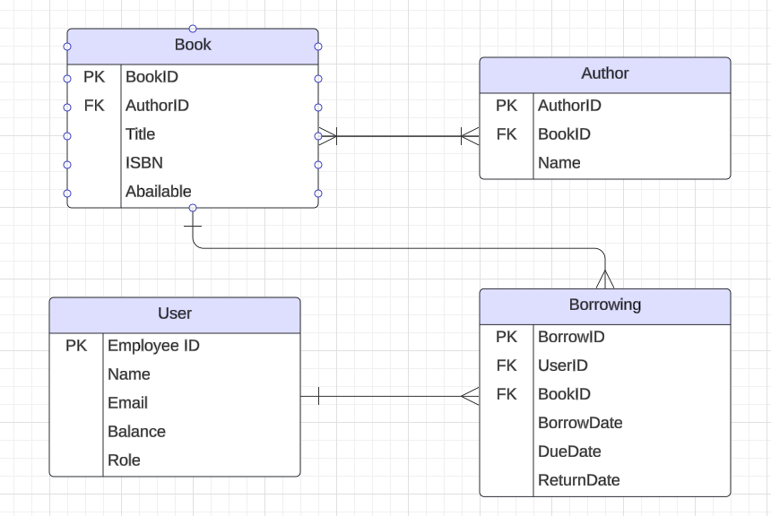

# Book Lending Library

This is a Full Stack Web App made in .NET to manage a library system where users can lend and return books.

## Project Members
- Bingrun Zheng

## Project Requirements
- The application should be ASP.NET Core application
- Application must build and run.
- The application should have unit tests and at least 20% coverage (at least 5 unit tests that tests 5 different methods/functionality of your code)
- The application should communicate via HTTP(s) (Must have POST, GET, DELETE)
- The application should be RESTful API
- The application should persist data to a SQL Server DB
- The application should communicate to DB via EF Core (Entity Framework Core)
- Utilize an external API (ISBN lookup)

## Tech Stack
- C# (Back End Programming Language)
- SQL Server (Azure Hosted)
- EF Core (ORM Tech)
- ASP.NET (Web API Framework)

## User Stories
- User should be able to login/logout if they already have an account
- User should be able to register if they do not have an account
- User should be able to view available books in the library
- User should be able to borrow books
- User should be able to return books
- User should be able to view their borrowing history
- Librarians should be able to add, edit, or remove books

## Tables

## MVP Goals
- Users can view a list of all books available for borrowing
- Users can borrow books, with a record of the borrowing date and due date
- Users can return books, updating their availability status
- Users can view their borrowing history
- Books and user data are persisted in the database, accessible even after session ends

## Stretch Goals
- Implement login/logout and register functionality for multiple users
- User authentication and password encryption
- Integration with an external API for book information (ISBN lookup)
- Implement a fine system for late returns
- Option for users to rate or review books
- Possibly implement Dockersize for packaging application